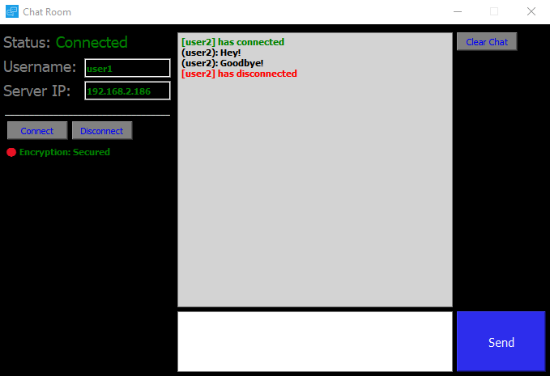

# Graphical-Chat-System
A Chat System with a Graphical User Interface written in Python 3 utilizing the PyQt5 Library and Fernet Encryption Library for sending and receiving messages safely.
This Chat System works on any Local Area Network and can be extended to work anywhere on different networks for clients to connect to but must be forwarded to Port: 5005 (as set)

[+] Server (server.py) must be running for clients to connect to it and communicate

[+] Clients (chat.py) must be binded to the Server IP Address

[+] No Limit to how many clients can connect to the server

